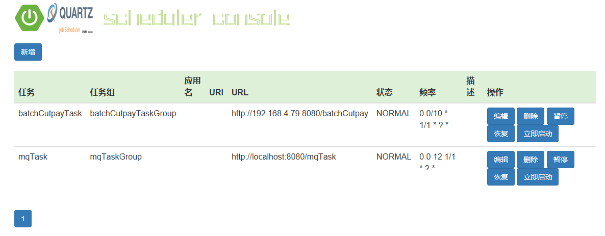

# msa-scheduler
 

### Introduction
msa-scheduler是为调度众多定时任务而生的调度中心，msa-scheduler单机最大可承受几万个定时任务的执行，可采用集群模式，可将定时任务平均
分配到各个集群节点，减轻单机执行任务的负担，有如下特点：
- 可伸缩
- 错失触发
- 任务优先级

### Quick Start
##### step1:下载二进制包并解压
[scheduler-1.0.0.zip](https://github.com/microcmpt/msa-scheduler/blob/master/downloads/1.0.0/msa-scheduler-1.0.0.zip)

##### step2:执行doc下的sql脚本

##### step3:启动scheduler
- [windows]
  执行start-scheduler.cmd脚本
- [linux]
  执行start-scheduler.sh脚本

##### step4:访问scheduler web控制台
输入http://localhost:8080/scheduler-ui.html

##### step5:添加一个定时任务
新增一个定时器任务

### Properties Introduction
<table>
   <tr>
      <td>属性</td>
      <td>值</td>
      <td>说明</td>
   </tr>
   <tr>
      <td>scheduler.zk.enable</td>
      <td>true/false</td>
      <td>开启zk服务注册中心，默认为false</td>
   </tr>
   <tr>
      <td>scheduler.zk.addresses</td>
      <td>localhost:2181</td>
      <td>zk访问地址，根据自己的zk地址而定，多个以英文逗号分隔</td>
   </tr>
   <tr>
      <td>scheduler.mail.enable</td>
      <td>true/false</td>
      <td>是否开启发送邮件通知</td>
   </tr>
   <tr>
      <td>scheduler.mail.host</td>
      <td>示例格式：smtp.qq.com</td>
      <td>邮箱主机服务器地址</td>
   </tr>
   <tr>
      <td>scheduler.mail.username</td>
      <td>示例格式：1378127237@qq.com</td>
      <td>发送人邮件地址</td>
   </tr>
   <tr>
      <td>scheduler.mail.password</td>
      <td></td>
      <td>发送人邮箱授权码，加密后的</td>
   </tr>
   <tr>
      <td>scheduler.mail.protocol</td>
      <td>smtp</td>
      <td>邮箱协议，默认为smtp</td>
   </tr>
   <tr>
      <td>scheduler.mail.to</td>
      <td>示例格式：1378127237@qq.com</td>
      <td>接收人邮箱地址，多个以英文逗号分隔</td>
   </tr>
   <tr>
      <td>scheduler.mail.properties.mail.smtp.auth</td>
      <td>true/false</td>
      <td>邮箱授权</td>
   </tr>
   <tr>
      <td>scheduler.mail.properties.mail.smtp.starttls.enable</td>
      <td>true/false</td>
      <td>开启tls</td>
   </tr>
   <tr>
      <td>scheduler.mail.properties.mail.smtp.stattls.required</td>
      <td>true/false</td>
      <td>ttl是否必要</td>
   </tr>
   <tr>
      <td>scheduler.quartz.threadPool.threadCount</td>
      <td>示例格式：13</td>
      <td>quartz核心线程池大小</td>
   </tr>  
   <tr>
      <td>scheduler.quartz.dataSource.quartzDS.driver</td>
      <td>示例格式：com.mysql.jdbc.Driver</td>
      <td>mysql数据库驱动类，如果是6.0版本以上驱动类注意</td>
   </tr>
   <tr>
      <td>scheduler.quartz.dataSource.quartzDS.URL</td>
      <td>示例格式：jdbc:mysql://localhost:3306/quartz?characterEncoding=utf-8&useSSL=false</td>
      <td>mysql数据库地址</td>
   </tr>
   <tr>
      <td>scheduler.quartz.dataSource.quartzDS.user</td>
      <td>示例：root</td>
      <td>数据库用户名</td>
   </tr>
   <tr>
      <td>scheduler.quartz.dataSource.quartzDS.password</td>
      <td>示例格式：123456</td>
      <td>数据库密码</td>
   </tr>
   <tr>
      <td>scheduler.quartz.dataSource.quartzDS.maxConnections</td>
      <td>示例格式：5</td>
      <td>数据库最大连接池大小</td>
   </tr>
   <tr>
      <td>scheduler.quartz.jobStore.isClustered</td>
      <td>true/false</td>
      <td>开启集群</td>
   </tr>
   <tr>
      <td>scheduler.quartz.jobStore.clusterCheckinInterval</td>
      <td>示例格式：15000</td>
      <td>集群节点心跳检测时间</td>
   </tr>
   <tr>
      <td>scheduler.okhttp.connect-timeout</td>
      <td>示例格式：20</td>
      <td>http连接超时时间，单位：秒</td>
   </tr>
   <tr>
      <td>scheduler.okhttp.read-timeout</td>
      <td>示例格式：30</td>
      <td>http读超时间，单位：秒</td>
   </tr>
   <tr>
      <td>scheduler.okhttp.write-timeout</td>
      <td>示例格式：30</td>
      <td>http写超时间，单位：秒</td>
   </tr>
   <tr>
      <td>scheduler.okhttp.retries</td>
      <td>示例格式：3</td>
      <td>http请求重试次数</td>
   </tr>
   <tr>
      <td>scheduler.quartz.threadPool.threadCount</td>
      <td>示例格式：13</td>
      <td>quartz核心线程池大小</td>
   </tr>  
 </table>